<!--
  CampusIQ - The AI Student Operating System
  Simple. Elegant. Powerful.
-->

<div align="center">
  
 
  # 🎓 CampusIQ
  ### *Transforming Academic Complexity into AI-Driven Clarity*

  [](https://nextjs.org/)
  [](https://react.dev/)
  [](https://www.prisma.io/)
  [](https://ai.google.dev/)
  [](https://clerk.com/)

  **CampusIQ** is a premium, AI-powered academic operating system designed for modern students. It bridges the gap between curriculum and career by building an autonomous bridge from Semester 1 to your professional debut.

  [**Explore Features**](#-core-features) • [**Tech Stack**](#-tech-stack) • [**Setup Guide**](#-quick-start)
</div>

---

## 🛸 The Platform Experience

### 🌌 Universal Landing Page
A high-fidelity entry point featuring a "Cyber-Nexus" aesthetic with seamless dual-theme transitions.
<div align="center">
  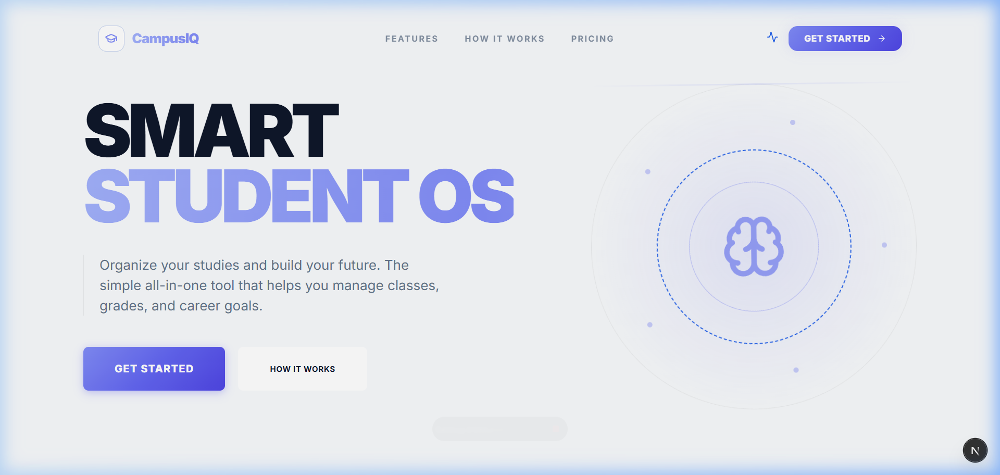
  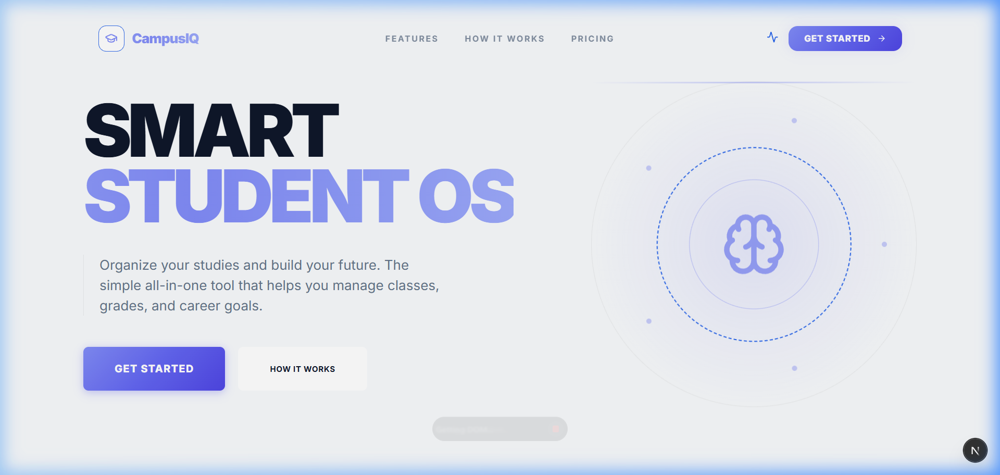
</div>

### 🔑 Secure Authentication
Glassmorphic Sign-in/Sign-up flows with native theme synchronization and marketing-led onboarding.
<div align="center">
  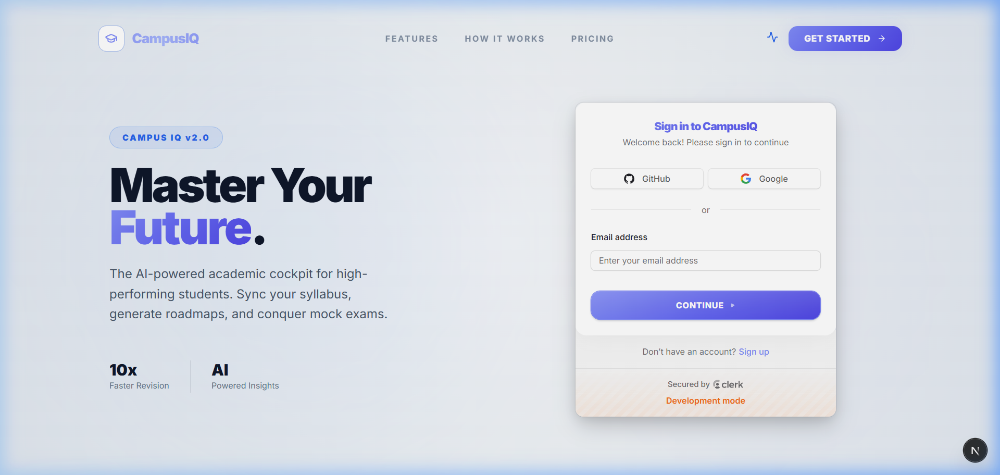
  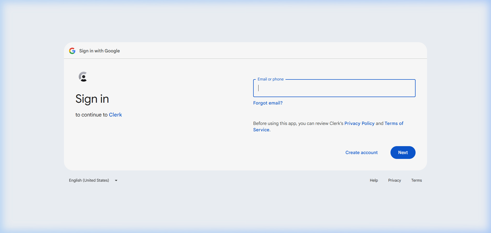
</div>

---

## ⚙️ Core Engine

### 🔋 Intelligence Cockpit
The centralized dashboard to track activity, latest mock scores, and overall readiness at a glance.
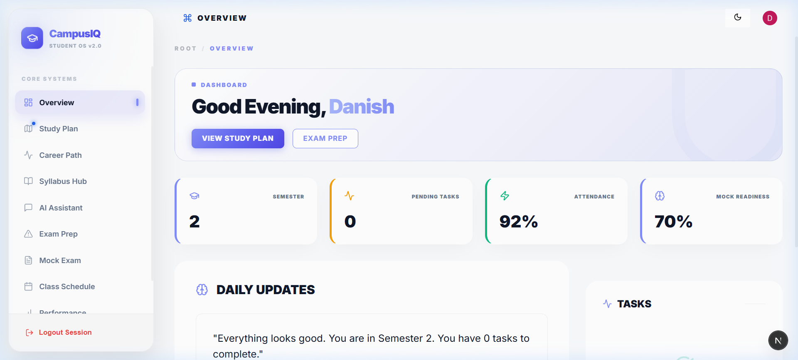

### 🧠 8-Semester Autopilot
A living academic roadmap that re-calibrates based on career goals, bridging the gap to industry-ready skills.
<div align="center">
  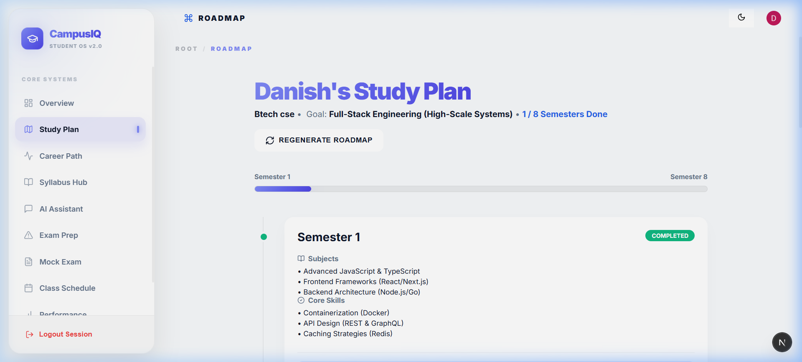
  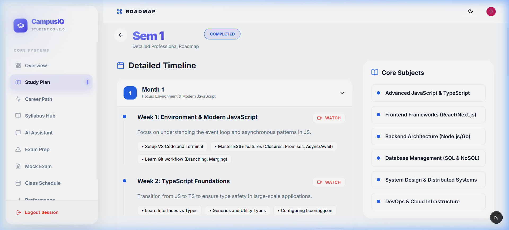
</div>
<br/>

### 📁 Syllabus Hub
Multimodal subject extraction—upload your syllabus and let Gemini AI generate interactive academic cards.
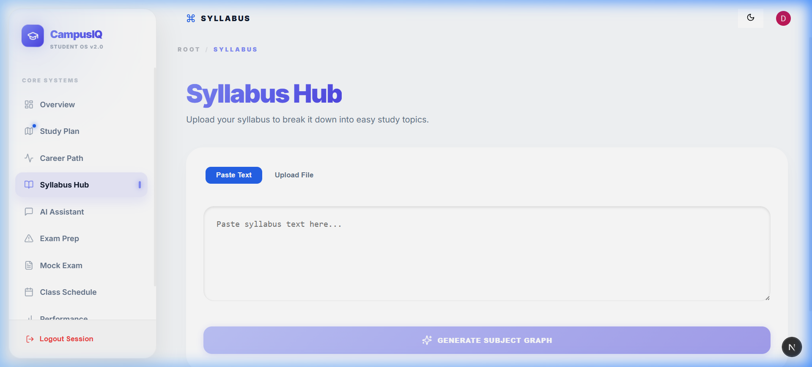

### 🛡️ Exam Simulator
A professional 75-mark simulator featuring AI grading and a resilient local fallback engine.
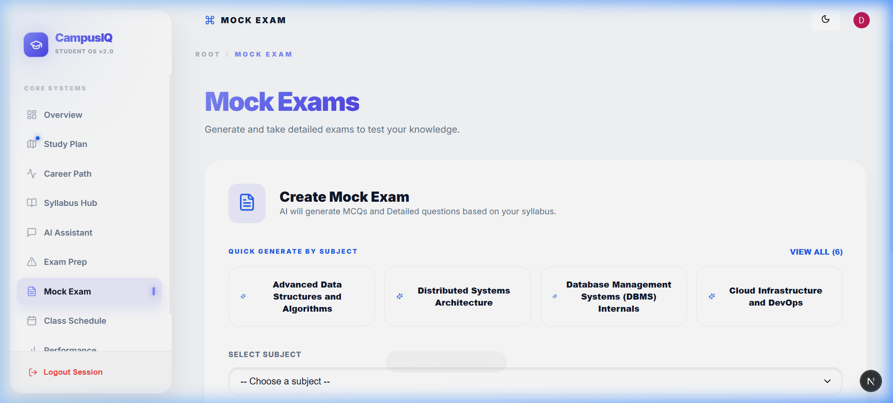

### 📈 Global Analytics
Deep-dive into subject mastery through heatmaps and track your complete mock examination history.
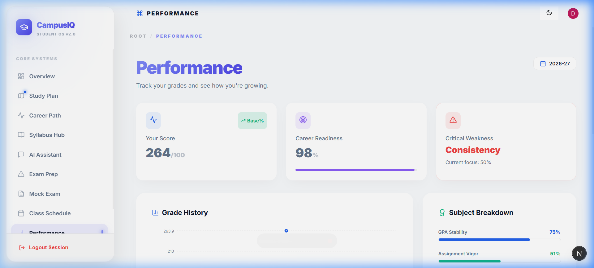

---

## 🎨 Component Showcase

Individual UI building blocks engineered for visual excellence.

<div align="center">
  <table border="0">
    <tr>
      <td width="50%">
        <strong>Telemetry Cockpit</strong><br/>
        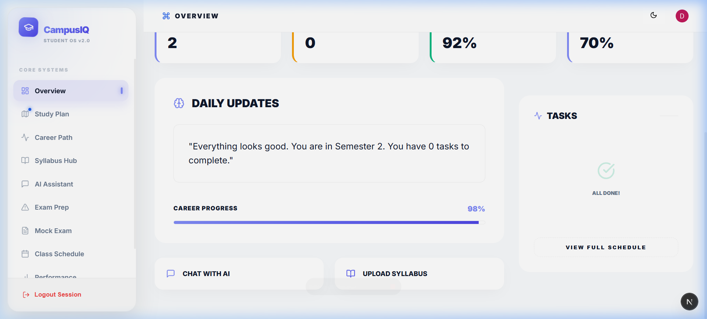<br/>
        <em>Real-time monitoring of academic vigor.</em>
      </td>
      <td width="50%">
        <strong>Subject Selector</strong><br/>
        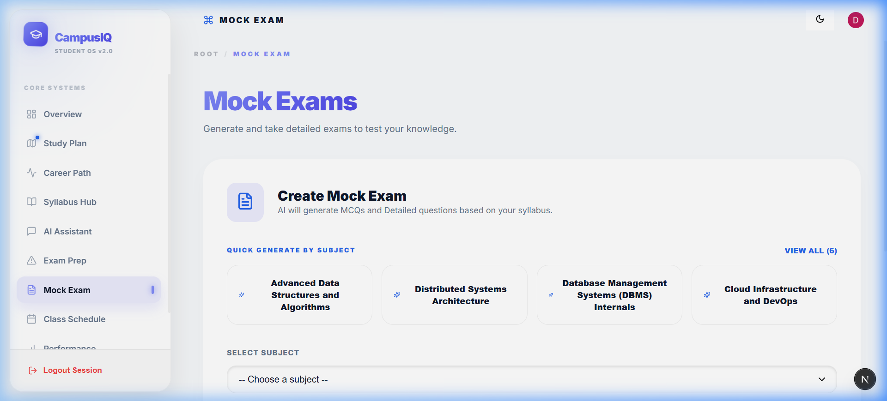<br/>
        <em>Instant generation grid.</em>
      </td>
    </tr>
    <tr>
      <td width="50%">
        <strong>Heatmap Analytics</strong><br/>
        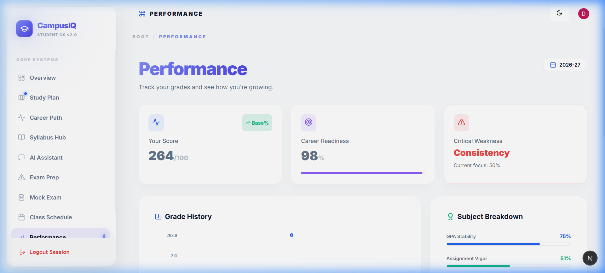<br/>
        <em>Visual mastery mapping.</em>
      </td>
      <td width="50%">
        <strong>Focus Answering</strong><br/>
        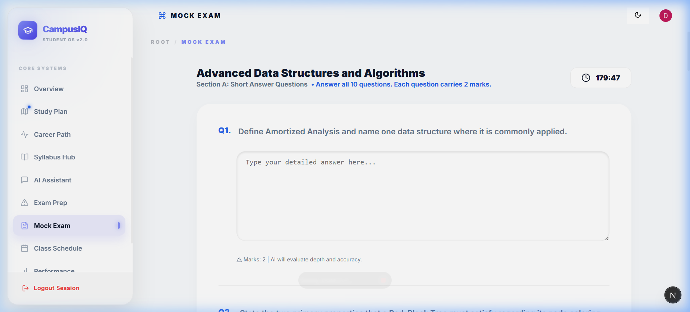<br/>
        <em>Distraction-free environment.</em>
      </td>
    </tr>
  </table>
</div>

---

## 🛠️ Tech Stack

| Layer | Technology |
| :--- | :--- |
| **Framework** | **Next.js 16** (App Router) |
| **Intelligence** | **Google Gemini 1.5 Flash** |
| **Database** | **PostgreSQL** via **Prisma** |
| **Security** | **Clerk** (Enterprise Auth) |
| **UI Engine** | **Vanilla CSS & Framer Motion** |
| **State** | **Zustand** |

---

## 🚀 Getting Started

1.  **Clone & Install**
    ```bash
    git clone https://github.com/danish-rizwan-dev/CampusIQ.git
    cd CampusIQ
    npm install
    ```

2.  **Initialize**
    Create `.env` with your keys, then run:
    ```bash
    npx prisma db push
    npm run db:seed
    npm run dev
    ```

---

<div align="center">
  <b>Built for the ambitious. Engineered by Danish Rizwan.</b>
  <br />
  CampusIQ © 2026 • Your Academic OS is Online.
</div>
